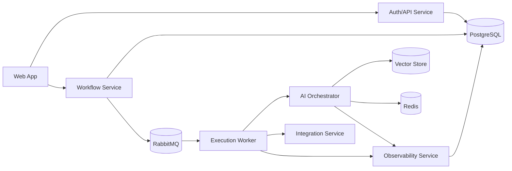

# Architecture

## Goal

FlowPilot AI is a portfolio-grade distributed platform for workflow automation and AI orchestration. The architecture is intentionally modular so each service has a clear responsibility and can be discussed independently in interviews.

## High-Level System



## Service Boundaries

### Web App

Next.js frontend for workspaces, workflows, executions, and AI traces.

### Auth/API Service

Owns identity-adjacent application data: users, workspaces, roles, permissions, and JWT issuance or validation.

### Workflow Service

Owns workflow definitions, triggers, execution records, node metadata, and public workflow APIs.

### Execution Worker

Consumes RabbitMQ execution jobs and runs workflow nodes. It is horizontally scalable and isolated from request/response API latency.

### AI Orchestrator

Owns LangChain flows, RAG, memory, tools, model provider abstraction, and AI-specific execution behavior.

### Observability Service

Captures workflow execution logs and LLM traces, including latency, token usage, estimated cost, inputs, outputs, and errors.

### Integration Service

Provides external adapters such as webhook handling, HTTP requests, mock CRM, email, Slack-like notifications, or document ingestion.

## Messaging

RabbitMQ is the main service-to-service broker for asynchronous work.

Initial event names:

- `workflow.execution.requested`
- `workflow.execution.started`
- `workflow.node.execution.started`
- `workflow.node.execution.completed`
- `workflow.node.execution.failed`
- `workflow.execution.completed`
- `workflow.execution.failed`
- `ai.trace.created`

## Redis Usage

Redis should not be the primary queue. It will be used for:

- Permission cache
- Rate limiting
- Short-lived locks
- Temporary execution state
- Optional chat memory cache

## Data Strategy

PostgreSQL stores transactional data. Vector search can use Qdrant or pgvector. The project should start with the simpler option and document the trade-off.

Initial local development uses Qdrant as a separate vector store to make the RAG boundary visible in the architecture. pgvector remains a possible simplification if local operational overhead becomes more important than demonstrating service separation.

## Monorepo Layout

The repository starts as a TypeScript-first pnpm workspace.

```txt
apps/
  web/                    Next.js dashboard, to be expanded after backend foundations
  api/                    auth, users, workspaces, roles, permissions, JWT
  workflow-service/       workflow definitions, triggers, executions, node metadata
  execution-worker/       RabbitMQ consumer and node execution runtime
  ai-orchestrator/        LangChain, RAG, memory, tools, provider abstraction
  observability-service/  workflow logs and LLM traces
packages/
  contracts/              shared RabbitMQ event contracts
  config/                 shared environment config loading
  logger/                 shared structured logger
```

## Local Infrastructure

`docker-compose.yml` defines the first local dependencies:

- PostgreSQL
- RabbitMQ with management UI
- Redis
- Qdrant

Application services are not containerized yet. Dockerfiles should be added after the first service APIs and worker process are implemented.

## Security Strategy

- JWT authentication
- Workspace-scoped access
- Role-based permissions
- Tenant-aware query filtering
- No secrets committed to the repository
- Explicit origin handling if iframe or embedded apps are ever introduced
