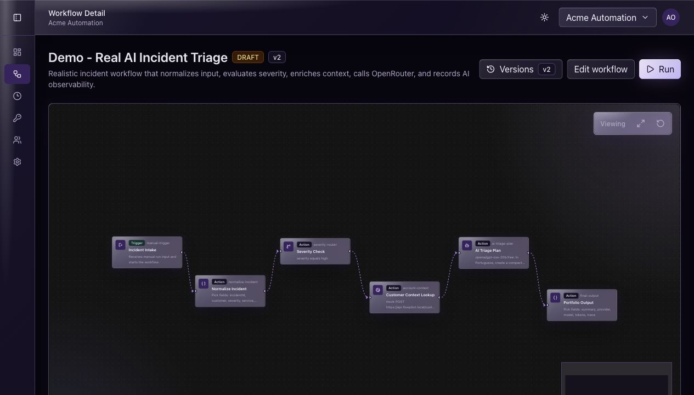
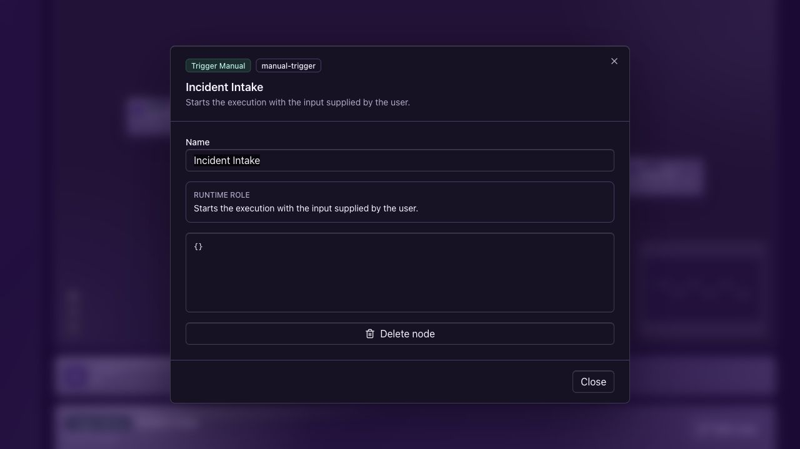
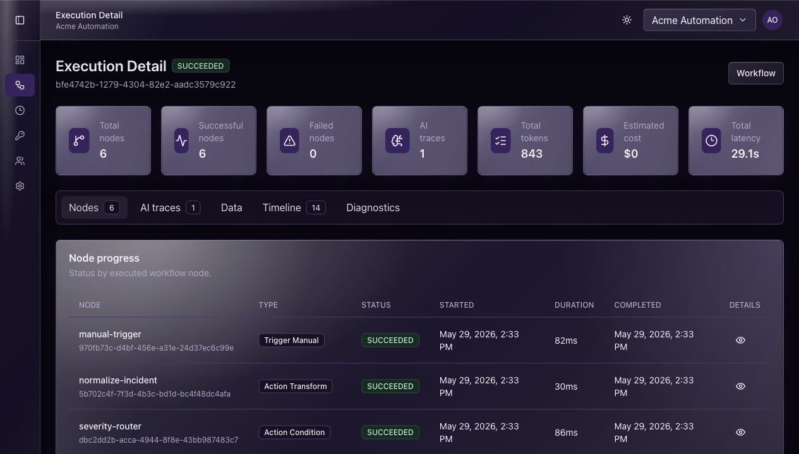
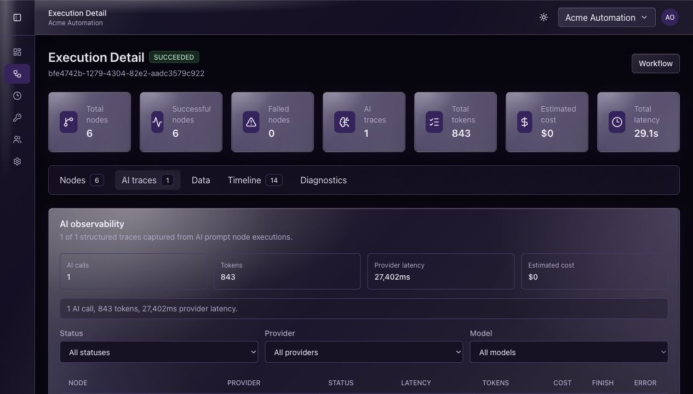
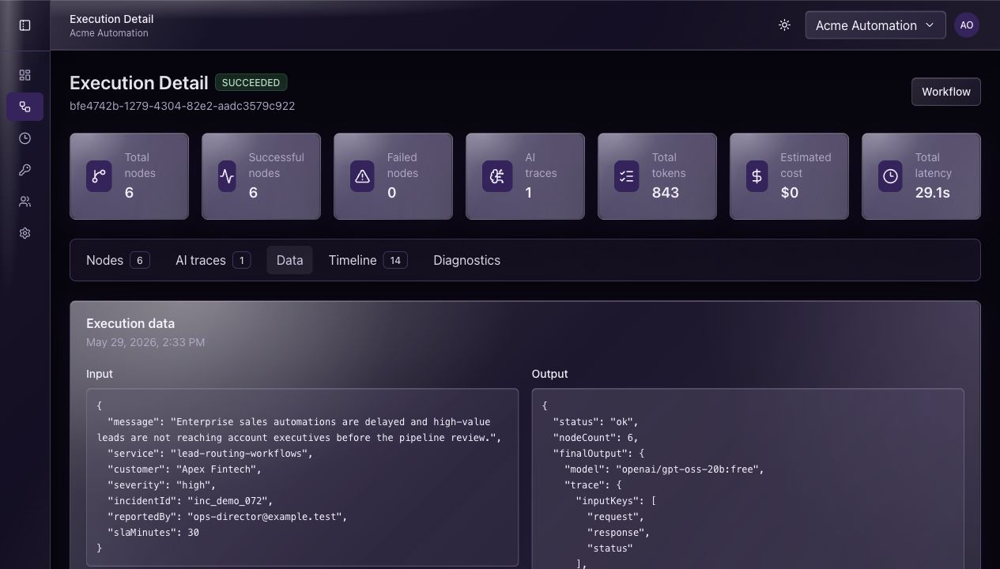
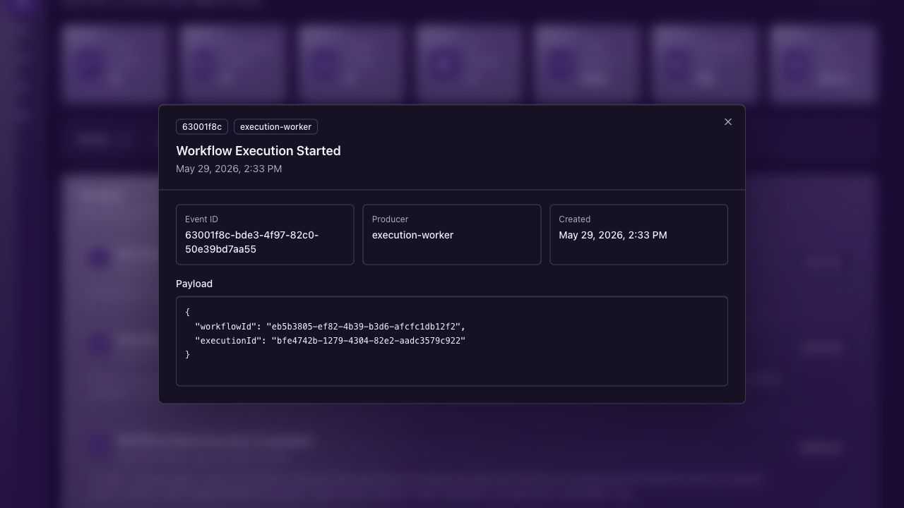
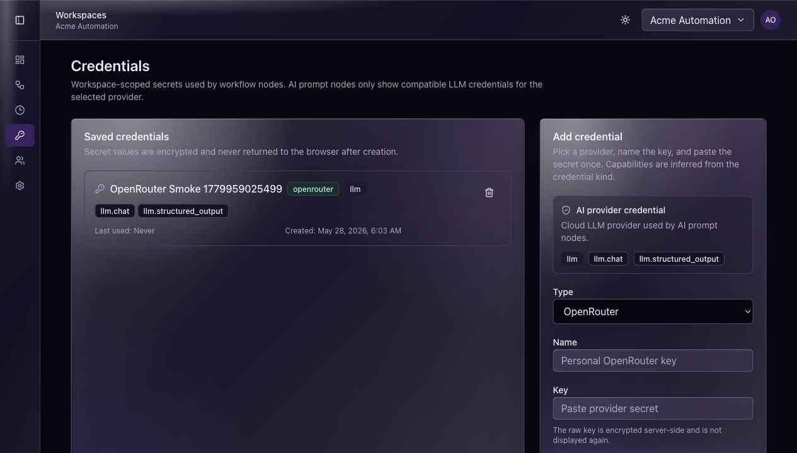
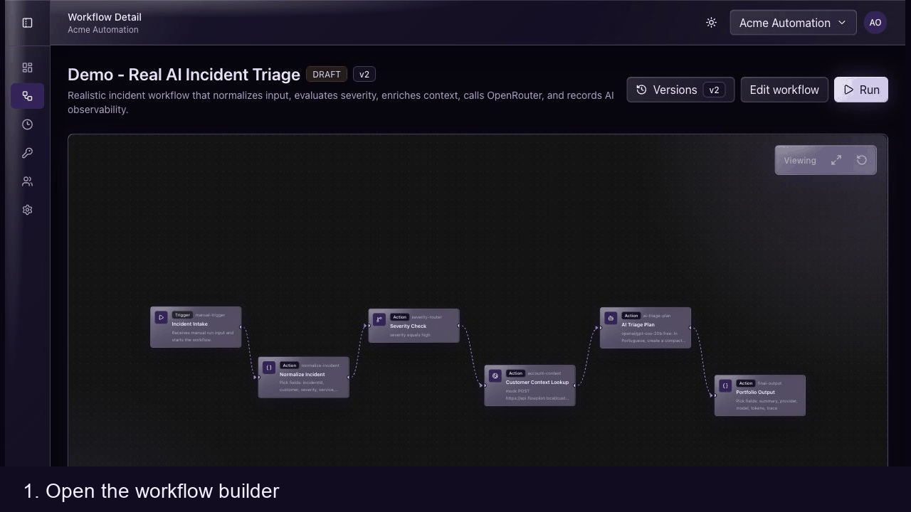

# Demo Guide

## Goal

This guide reproduces the portfolio workflow demo from a fresh local environment.

The demo shows FlowPilot AI running a realistic incident triage workflow with:

- Manual workflow execution.
- Transform node.
- Condition node.
- HTTP request node in mock mode.
- AI prompt node through the Python AI Orchestrator.
- Execution detail observability with node progress, timeline, execution data, diagnostics, and AI traces.

## Start The Stack

```bash
docker compose up -d
```

Then seed the demo workspace and workflows:

```bash
pnpm --filter @flowpilot/api seed:demo
```

The seed creates:

- Workspace: `Acme Automation`
- Login: `owner@acme.test`
- Password: `correct horse battery staple`
- Workflow: `Lead Enrichment`
- Portfolio workflow: `Demo - Real AI Incident Triage`

## Run The Portfolio Workflow

Open the web app:

```txt
http://localhost:5173
```

Sign in with the seeded user and open:

```txt
Workflows -> Demo - Real AI Incident Triage
```

Use this execution input:

```json
{
  "incidentId": "inc_demo_072",
  "customer": "Apex Fintech",
  "severity": "high",
  "service": "lead-routing-workflows",
  "reportedBy": "ops-director@example.test",
  "slaMinutes": 30,
  "message": "Enterprise sales automations are delayed and high-value leads are not reaching account executives before the pipeline review."
}
```

The seeded workflow uses the deterministic provider by default so the demo can run without an external API key.

## Optional Real Provider Demo

To run the AI node with OpenRouter:

1. Open `Credentials`.
2. Add an `OpenRouter` credential.
3. Open `Demo - Real AI Incident Triage`.
4. Edit `AI Triage Plan`.
5. Set provider to `OpenRouter`.
6. Select the compatible credential.
7. Keep or change the model, for example `openai/gpt-oss-20b:free`.
8. Save a new workflow version.
9. Run the workflow again.

The execution detail page should show an AI trace with provider, model, status, token usage, estimated cost, finish reason, and provider latency.

## What To Capture For A Portfolio Demo

Reference screenshots:

### Workflow Builder



### AI Node Configuration



### Execution Summary



### AI Traces



### Execution Data



### Timeline Event Modal



### Credentials



### Short GIF



Recommended talking points:

- RabbitMQ handles asynchronous workflow execution.
- The worker calls the Python AI Orchestrator synchronously for AI node output.
- Credentials are workspace-scoped and referenced by ID from workflow definitions.
- AI traces turn LLM calls into structured operational data.
- The same workflow can run against deterministic, OpenRouter, and future local/cloud providers.
